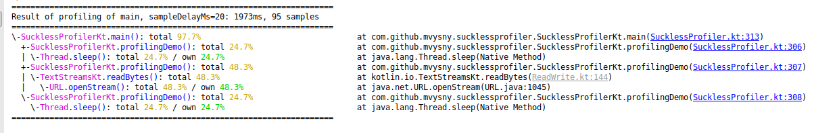

# Suckless ASCII Profiler

An embedded JVM profiler which you start and stop at will from your code, and it will dump the profiling info into 
the console:



* Identifies longest-running methods in your code. Just follow the largest percentage trail.
* Uses thread stacktrace sampling, so the overhead is negligible. The accuracy
is not that great, but it definitely can identify the bottleneck in your code.
* IDE turns the console log into clickable links so you can navigate into your code easily

What it's not:

* Remote profiler - cannot connect to a remote JVM
* Debugger
* It doesn't gather JVM/system statistics like CPU usage, memory usage and/or disk usage.
* You need an initial hunch on where your code is actually slow, so that you can place the `profile` method around the code.

Please see [the introductionary video](https://www.youtube.com/watch?v=LhPLXStYePw) for more details.

## Demo

We're going to profile the [sample main method](src/main/kotlin/com/github/mvysny/sucklessprofiler/SucklessProfiler.kt#L252) which looks like this:
```kotlin
Thread.sleep(500)
println(URL("https://aedict-online.eu").readText())
Thread.sleep(500)
```

Simply type this into your console:

```bash
git clone https://github.com/mvysny/suckless-ascii-profiler
cd suckless-ascii-profiler
./gradlew run
```

And you should see the output similar to the screenshot above.

## Usage

Add the following repository and dependency to your gradle script:

```groovy
repositories {
    maven { url "https://dl.bintray.com/mvysny/github/" }
}
dependencies {
    compile "com.github.mvysny.sucklessprofiler:suckless-profiler:0.2"
}
```

Then, in your code, just call the following:

```java
final SucklessProfiler p = new SucklessProfiler();
p.start();
callMethodYouNeedToProfile();
p.stop();  // this will dump the profiling info into the console
```

or in Kotlin:

```kotlin
SucklessProfiler().apply {
    coloredDump = true
}.profile {
    Thread.sleep(500)
    println(URL("https://aedict-online.eu").readText())
    Thread.sleep(500)
}   // this will call the stop() method and will dump the profiling info into the console 
```

or in your (Vaadin) Servlet:

```kotlin
@WebServlet(urlPatterns = arrayOf("/*"), name = "MyUIServlet", asyncSupported = true)
@VaadinServletConfiguration(ui = MyUI::class, productionMode = false)
class MyUIServlet : VaadinServlet() {
    override fun service(request: HttpServletRequest?, response: HttpServletResponse?) {
        SucklessProfiler().apply {
            coloredDump = true
            pruneStacktraceBottom = true
        }.profile {
            super.service(request, response)
        }
    }
}
```

#### About Stacktrace Sampling

A thread stacktrace is captured every 20ms (configurable) into a list of stacktrace samples. That list
is afterwards converted to a tree, and the time spent is assigned. The Stacktrace Sampling method of
profiling is non-intrusive: for example
you don't have to start a Java agent, as opposed to the tracing method (where every method is intercepted and call
statistics are stored - very accurate but very slow and often unnecessary). Stacktrace Sampling will thus profile a real code execution.

Stacktrace sampling is also unfortunately quite inaccurate. Sampling stacktrace every 20ms means that we have no idea what's going
on during those 20ms inbetween samplings. Thus, if a method is sampled only once, we cannot check whether
the method took less than 1ms to run, or whether it took 39ms. To remedy this, you can increase the sampling rate to 10ms
(or even 2ms) to obtain more accurate results while still maintaining quite minor performance hit. However, this is often not required.

Usually what you hunt for is the place where your code spends 200ms or more. And that is something we can
detect with high accuracy. If a method is present in multiple samplings, then there is a high
probability that that method was running quite long. Of course there is also the possibility that
the method was called repeatedly, ran shortly and was captured in multiple stack samplings,
but the probability of this is very low.

To conclude:

* Ignore methods present in just one sample (they are marked with the less-than sign, such as >1%)
* Focus on long-running methods, and dissect them until you find a culprit
* Remember that there is a very low probability that the profiler is lying to you :-)
